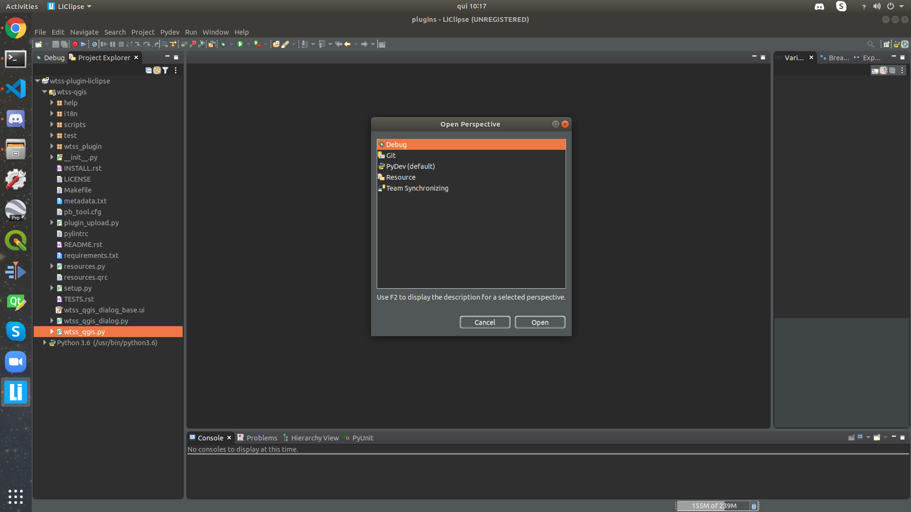

# Como debugar Python Plugins QGIS com o Liclipse

[](https://qgis.org/en/site/)
[](https://plugins.qgis.org/)
[](https://pypi.org/project/PyQt5/)
[](https://www.liclipse.com/index.html)

A maneira mais eficaz para encontrar defeitos em um software é a partir de testes, porém alguns problemas correntes podem aparecer durante o desenvolvimento de software que podem ser facilmente identificados pelo processo de Debug. Como fazer debug no desenvolvimento de plugins no QGIS utilizando a IDE LiClipse utilizando Linux e QGIS 3+.

1. O primeiro passo é a instalação do LiClipse que pode ser baixado e instalado por este link https://www.liclipse.com/download.html;

<p align = "center">
  
</p>

2. É aconselhável mover o código fonte do plugin para a pasta de instalação do _QGIS_ localizada em `.local/share/QGIS/QGIS3/profiles/default/python/plugins/`;

<p align = "center">
  
</p>

3. Abra a tela inicial do _LiClipse_ e crie um novo projeto como _PyDev Project_ apontando para a pasta home do _QGIS_ na função `Create link to existing sources -> Add External Source Folder` inserindo o diretório onde o código fonte do plugin está localizado;

<p align = "center">
  
</p>

<p align = "center">
  
</p>

<p align = "center">
  
</p>

<p align = "center">
  
</p>

4. Com o código fonte do plugin aberto selecione a aba `Window` e as opções `perspective -> open perspective -> other`;
5. Selecione a opção `Debug` para as opções de _Perspective_;

<p align = "center">
  
</p>

6. Com o código fonte do plugin aberto selecione a aba `PyDev`, selecione a opção `Start Debug Server` e crie um _`Brakepoint`_ na primeira linha da função `run()`;

<p align = "center">
  
</p>

7. Abra a tela inicial do QGIS e abra as configurações do sistema `Settings -> Options -> System`;

<p align = "center">
  
</p>

8. Nas opções para variáveis de ambiente marque a opção `Use custom variables`;
9. Com a opção `Append` insira a variável de ambiente _Python LiClipse_ para plugins geralmente em `<user_home>/liclipse/plugins/org.python.pydev.core_7.5.0.202001101115/pysrc/`, insira desta forma `PYTHONPATH=<user_home>/liclipse/plugins/org.python.pydev.core_7.5.0.202001101115/pysrc/`;

<p align = "center">
  
</p>

10. Abra o terminal python do _QGIS_ em `Plugins -> Python Console` e digite os seguintes comandos, para se conectar com o servidor de _Debug_, usualmente localizado na porta `5679`:

```python
import pydevd
pydevd.settrace(port=5678, suspend=False)
```

<p align = "center">
  
</p>

Com isso já é possível iniciar o plugin normalmente e visualizar as variáveis e seus valores dentro do fluxo do código na janela do _LiCLipse_ :thumbsup:.
